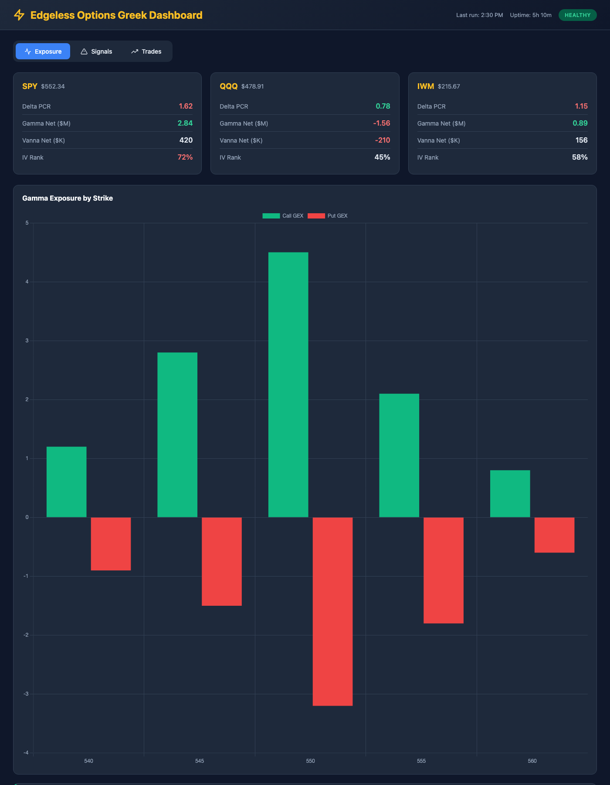
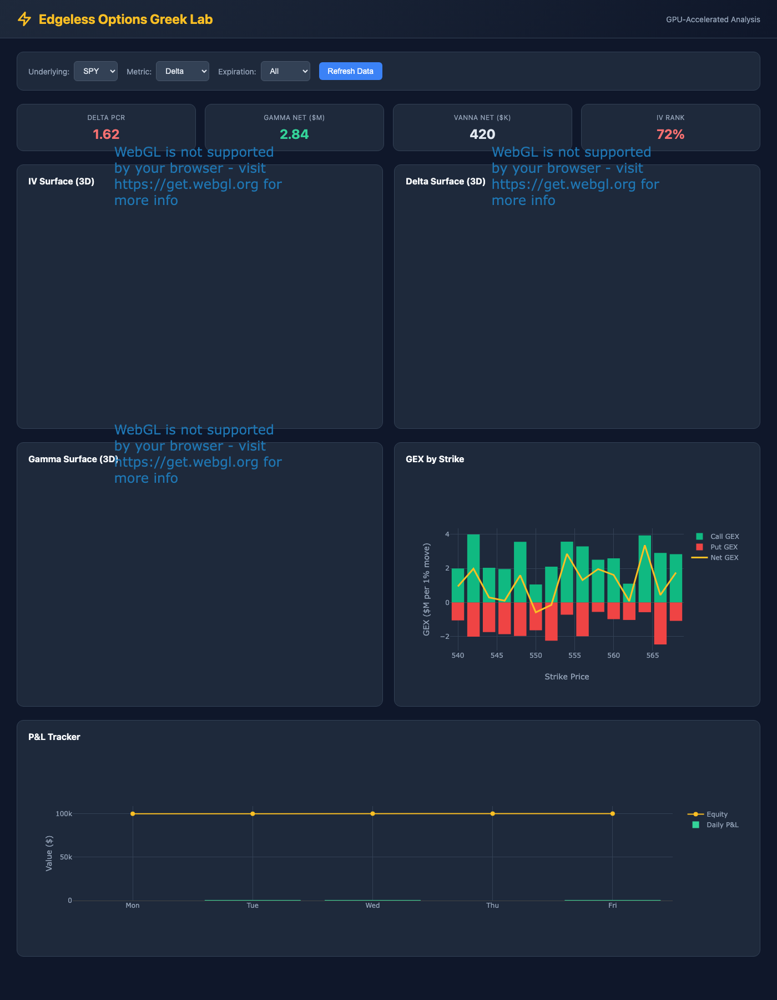

# Edgeless Options Greek Automation

**Real-time options trading system based on Greek exposure analysis.**

Inspired by [Olivia Schremmer's framework](https://www.instagram.com/reel/DZTvRRkCZXO) — Delta Put/Call Ratio for directional bias, Gamma exposure for entry/target levels, Vanna for weekly alignment.

---

## System Overview



### Architecture

```
├── Data Layer (ConvexValue API)
│   └── Real-time options chains + Greeks
├── Ingestion Layer
│   └── Circuit breaker → Quality gate → SQLite
├── Analytics Layer
│   └── Dollar Greeks → GEX → IV term structure
├── Strategy Layer
│   └── Reel Strategy (30/50/20) → Signals
├── Risk Layer
│   └── 6 guards → Correlation check → Sizing
├── Execution Layer
│   └── Alpaca Paper → Monitor loop → Exit mgmt
└── Dashboard Layer
    ├── Next.js (web UI)
    └── Marimo (GPU lab)
```

---

## Key Features

### 1. Real-Time Data Ingestion
- **ConvexValue API** (free, live) — 36 expirations, 171+ strikes per underlying
- **Circuit breaker** pattern: 3 failures = 5-minute cooldown
- **Data quality gate**: rejects snapshots with >20% nulls
- **Fields**: delta, gamma, vega, theta, IV, OI, volume, bid/ask

### 2. Reel Strategy (30/50/20)

| Component | Weight | Input | Threshold |
|-----------|--------|-------|-----------|
| **Delta PCR** | 30% | Put/Call ratio | >1.20 (LONG), <0.80 (SHORT) |
| **Gamma Proximity** | 50% | Distance to GEX concentration | <2% of spot |
| **Vanna** | 20% | dVega/dSpot | >0.15 magnitude |

**Rules**:
- 14+ DTE action window
- Gamma levels as support/resistance
- Vanna weekly alignment
- Contrarian to delta PCR

### 3. Risk Guards

| Guard | Rule |
|-------|------|
| Market Hours | No trades within 30 min of open |
| Max Positions | 1 open per underlying |
| Daily Loss | <5% of equity |
| Correlation | Beta-weighted delta <10% portfolio |
| Min DTE | 14 days minimum |
| Expiration | Auto-close at 3:30 PM on expiry |

### 4. Dual Dashboard

**Next.js Dashboard** — Web UI with real-time updates:
- Exposure overview (GEX, delta PCR, vanna)
- Signal feed with confidence breakdown
- P&L tracker with trade history

**Marimo Lab** — GPU-accelerated analysis:
- 3D Greeks surfaces (IV, delta, gamma)
- GEX by strike chart
- Interactive parameter controls



### 5. Position Sizing

```python
# Kelly criterion with half-Kelly adjustment
f* = (bp - q) / b
contracts = calculate_position_size(
    account_equity=100_000,
    max_risk_pct=0.02,
    strategy_type="defined_risk",  # or "undefined_risk"
    max_loss_per_contract=500,
)
```

### 6. Monitor Loop

**Exit Rules**:
- 50% of max profit (TastyTrade rule)
- 21 DTE (auto-close or roll)
- Stop/target breach
- Auto-close at 3:30 PM on expiration day

---

## Quick Start

### 1. Install Dependencies

```bash
cd ~/Codex-projects/options-greek-automation
python3 -m venv .venv
source .venv/bin/activate
pip install -r requirements.txt
```

### 2. Set API Keys

```bash
cp .env.example .env
# Edit .env:
# - CV_API_KEY (from ConvexValue/cvforge)
# - ALPACA_API_KEY (from ~/.config/alpaca/config.yaml)
# - TELEGRAM_BOT_TOKEN (optional, for alerts)
```

### 3. Initialize Database

```bash
python db/engine.py
# Creates SQLite with WAL mode + 10 tables
```

### 4. Run Tests

```bash
pytest tests/ -v
# 11 tests, 100% pass rate
```

### 5. Verify Data Source

```bash
python clients/convexvalue_client.py
# Day 0 verification — should return 36 expirations for SPY
```

### 6. Run Pipeline

```bash
python jobs/orchestrator.py
# Full pipeline: ingest → compute → signal → guard → execute
```

### 7. Start Dashboard

```bash
# Next.js
cd dashboard/nextjs && pnpm install && pnpm run dev

# Marimo
marimo edit dashboard/marimo/options_lab.py
```

---

## Cron Schedule

```bash
# Pipeline every 5 minutes during market hours
*/5 * * * 1-5 cd ~/Codex-projects/options-greek-automation && source .venv/bin/activate && python jobs/orchestrator.py

# Monitor every minute
* * * * * cd ~/Codex-projects/options-greek-automation && source .venv/bin/activate && python execution/monitor.py

# Health check every hour
0 * * * * cd ~/Codex-projects/options-greek-automation && source .venv/bin/activate && python -c "from jobs.orchestrator import run_health_check; print(run_health_check())"

# Data purge weekly ( Sundays 2 AM)
0 2 * * 0 cd ~/Codex-projects/options-greek-automation && source .venv/bin/activate && python -c "from jobs.orchestrator import purge_old_data; print(purge_old_data(90))"
```

Install with: `crontab config/cron.txt`

---

## Directory Structure

```
├── clients/           # Data source adapters
│   ├── convexvalue_client.py
│   └── POLYPAM_DATA_FEED_BRIEF.md
├── ingest/            # Data ingestion
│   ├── pipeline.py
│   └── resilience.py
├── db/                # SQLite schema
│   └── engine.py
├── analytics/         # Exposure calculations
│   ├── exposure.py
│   └── iv_term.py
├── strategy/          # Signal generation
│   ├── reel_strategy.py
│   ├── vanna.py
│   └── optimizer.py
├── execution/         # Paper trading
│   ├── alpaca_client.py
│   ├── monitor.py
│   └── sizing.py
├── risk/              # Risk guards
│   └── guards.py
├── notify/            # Telegram alerts
│   └── telegram.py
├── jobs/              # Orchestration
│   └── orchestrator.py
├── telemetry/         # Metrics
│   └── metrics.py
├── dashboard/         # Dual dashboard
│   ├── nextjs/
│   └── marimo/
├── tests/             # Unit tests
├── config/            # Cron config
├── docs/              # Documentation
├── README.md          # This file
├── ARCHITECTURE.md    # Full system design
├── RUNBOOK.md         # Operations guide
└── requirements.txt
```

---

## Data Flow

```
ConvexValue API
    ↓
ingest/pipeline.py → resilience.py
    ↓
db/engine.py (SQLite WAL)
    ↓
analytics/exposure.py + iv_term.py
    ↓
strategy/reel_strategy.py (30/50/20)
    ↓
risk/guards.py (6 guards)
    ↓
execution/alpaca_client.py (paper)
    ↓
execution/monitor.py (exit loop)
    ↓
notify/telegram.py (alerts)
    ↓
telemetry/metrics.py (Prometheus)
```

---

## Key Metrics (Day 14 Targets)

| Metric | Target | Measurement |
|--------|--------|-------------|
| System uptime | >95% | Health check success rate |
| Signal latency | <5 min | Signal time − snapshot time |
| Data freshness | <6 min | Last snapshot age |
| Guard rejection | <20% | Rejection rate |
| Exception-free | 10/10 days | Pipeline run errors |

---

## API Documentation

### ConvexValue API
```python
from clients.convexvalue_client import ConvexValueClient

client = ConvexValueClient()
chain = client.get_chain("SPY", fields=["delta", "gamma", "vega", "theta", "iv"])
screen = client.screen(columns=["ticker", "iv", "oi"], filters=[{"field": "underlying", "op": "eq", "value": "SPY"}])
rows = client.query_sql("SELECT * FROM options_snapshots WHERE underlying = 'SPY' LIMIT 10")
client.close()
```

### Alpaca Paper Trading
```python
from execution.alpaca_client import AlpacaClient

client = AlpacaClient()
account = client.get_account()  # equity, cash, buying_power
client.submit_order("SPY260719C00550000", "buy", 2)  # OCC format
client.close_position("SPY260719C00550000")
client.update_account_state()
```

---

## Troubleshooting

| Issue | Solution |
|-------|----------|
| "Circuit breaker OPEN" | Wait 5 min; check API status |
| "Data quality gate failed" | Check null ratio in chain |
| "Alpaca order rejected" | Verify OCC format; single-leg only |
| "No signals" | Check thresholds; run optimizer |
| "DB locked" | `PRAGMA wal_checkpoint` |

Full guide: `RUNBOOK.md`

---

## Phase Roadmap

### Phase 1 (MVP, Weeks 1-2)
✅ 3 underlyings (SPY, QQQ, IWM)
✅ ConvexValue data
✅ SQLite persistence
✅ Single-leg paper trades

### Phase 2 (Weeks 3-4)
○ 10 underlyings
○ Schwab API for historical backfill
○ Real-time WebSocket
○ Parameter optimization

### Phase 3 (Weeks 5-6)
○ PostgreSQL migration
○ ChromaDB pattern matching
○ LLM signal narratives
○ Mobile-responsive dashboard

---

## Contributing

This is a personal trading research project. Not financial advice. All trades are paper-only.

---

**Built with**: Python, SQLite, ConvexValue API, Alpaca Paper, Next.js, Marimo, Plotly

**Author**: Edgeless Lab

**License**: MIT
